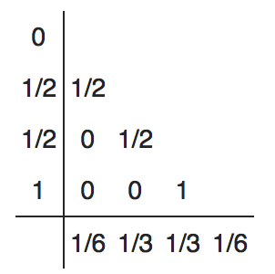
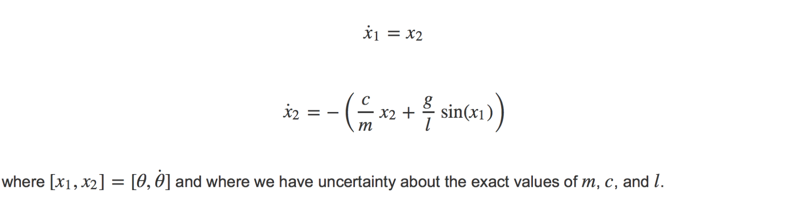

## Purpose
The purpose of **KrystalBall** is to provide a flexible and efficient simulation framework for tackling discrete, differential, and/or Monte Carlo simulations.

The goal of this framework is to allow a user to quickly be able to build a clean, functional simulation all bundled into a class entity for modular use and potential usage in black box functions for, say, optimization routines.

## Key Features
Some interesting features about the simulation framework are the following:
- Framework uses compile-time polymorphism to remove the run-time overhead for choices in one's integration scheme
- Framework uses a precise integer-based timer to maintain perfect times no matter what frequency your simulation models operates at, in turn maintaining good time accuracy and removing accumulation of round off errors
- Framework uses generalized integrator class structure that creates a complete and efficient integration scheme by just handing it a Butcher Tableau. This currently works for both normal and Adaptive explicit schemes that can be represented by a Butcher Tableau.
- Framework handles managing data for simulation variables under the good, providing a simple interface for users to use in the models
- Framework has functionality built in for writing data to files and handling the scheduling of discrete events in simulation time

## Things to Do
- Implement Implicit scheme builder based on Butcher Tableau
- Modify discrete models to allow them to output a time step that changes over time, instead of requiring each model to specify a time step that will be constant over the time of the simulation

## Example Integrator using Butcher Tableau Creation
One of the cool features built into this framework is the ability to create new numerical integration schemes very easily if they can be represented by a **Butcher Tableau** (and are explicit schemes, for now!). A typical example might be implementing a numerical integration scheme for 4th order Runge-Kutta. You can find the Butcher Tableau for 4th order Runge Kutta is the following:



Based on the aboe representation, we can implement this using the `ButcherIntegrator` base class in the framework doing the following:

```cpp
class RungeKutta4 : public ButcherIntegrator {
public:
  RungeKutta4():ButcherIntegrator(){
    btable.resize(4);
    btable.c(0) = 0.0; btable.a(0, 0) = 0;
    btable.c(1) = 0.5; btable.a(1,0)  = 0.5;
    btable.c(2) = 0.5; btable.a(2,1)  = 0.5;
    btable.c(3) = 1.0; btable.a(3,2)  = 1.0;
    btable.b(0,0) = 1.0/6.0;
    btable.b(0,1) = 1.0/3.0;
    btable.b(0,2) = 1.0/3.0;
    btable.b(0,3) = 1.0/6.0;
  }
};
```

As one can see, it's pretty straight forward to implementing a new scheme, given you know the associated Butcher Tableau. Pretty cool!

## Example Simulation
Examples can be found in the directory **src/Examples**. The first basic example one will find is for a pendulum with the following dynamics:


This can be represented in state space form as the following:



The dynamics can be written as the following:

```cpp
/*!
 * These dynamics represent a simple 1D nonlinear Pendulum model
 */
class PendulumModel : public DynamicModel {
    
public:
    
    // Constructor
    PendulumModel(){
        model_name = "pendulum";
    }
    
    // initializer for a given Monte Carlo sim
    virtual void initialize(){
        mass            = generator->rand() * 50 + 50;
        dampening       = generator->rand() * 15;
        lengthPendulum  = generator->rand() * 10;
        gravity         = 9.81;
        state[0]        = Constants::pi/3;  // initial condition for theta
        state[1]        = Constants::pi/12; // initial condition for theta-dot
    }
    
    // data to be printed to file
    virtual void setupPrintData(){
        simState->dataPrinter.addVariableToPrint(&state[0], "Theta");
        simState->dataPrinter.addVariableToPrint(&state[1], "ThetaDot");
    }
    
    // number of dimensions being integrated
    virtual int numDims() const { return 2; }
    
    // dynamics model
    virtual void operator()( double time , ModelState & dqdt ){
        double theta    = state[0];
        double thetaDot = state[1];
        dqdt[0] = thetaDot;
        dqdt[1] = -( dampening*thetaDot/mass + gravity * sin(theta)/ lengthPendulum);
    }
    
    
private:
    double mass;            // in kg
    double dampening;       // dampening factor
    double gravity;         // m/s^2
    double lengthPendulum;  // in meters
    
    
};
```

The corresponding simulation can then be, as an example, written to be the following:

```cpp
#include "Simulator.hpp"
#include "Pendulum.hpp"


class PendulumSim : public Simulator<PendulumSim,RungeKutta4> {
public:
    
    PendulumSim(){
        std::string historyFile("history.txt");
        setSimHistoryPath(historyFile);
        state.printFrequency = 30;
        numMC = 10;
        writeSimHistory = true;
    }
   
    
    void _linkModelsToSim( SimState & state ){
        addDiscrete(&tstep, 100);
        addDynamics(&pendulum);
    }
    void _connectModelsTogether(){
        
    }
    bool _finishedSimulation( SimState & state ) const{
        return getTime() > 5;
    }
    void _finalizeMonteCarloRun(){
        printf("Finished the %ith Monte Carlo run!\n",
                  static_cast<int>(getCompletedMC()));
    }
    void _finalize(){
        printf("Finished!\n");
    }
    
private:
    
    TimeStep tstep;
    PendulumModel pendulum;
    
};
```

This simulation can then be run by doing the following in your main function:

```cpp
#include "PendulumSim.hpp"

int main(int argc, const char * argv[]) {
  
    PendulumSim psim;
    psim.setSimHistoryPath("simhistory.txt");
    psim.runSim();
    
    return 0;
}
```